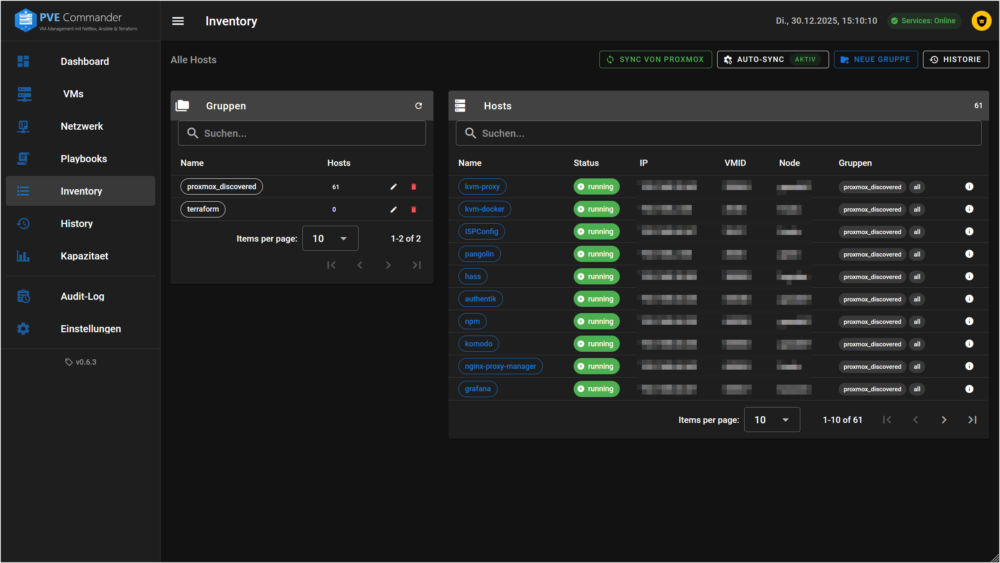
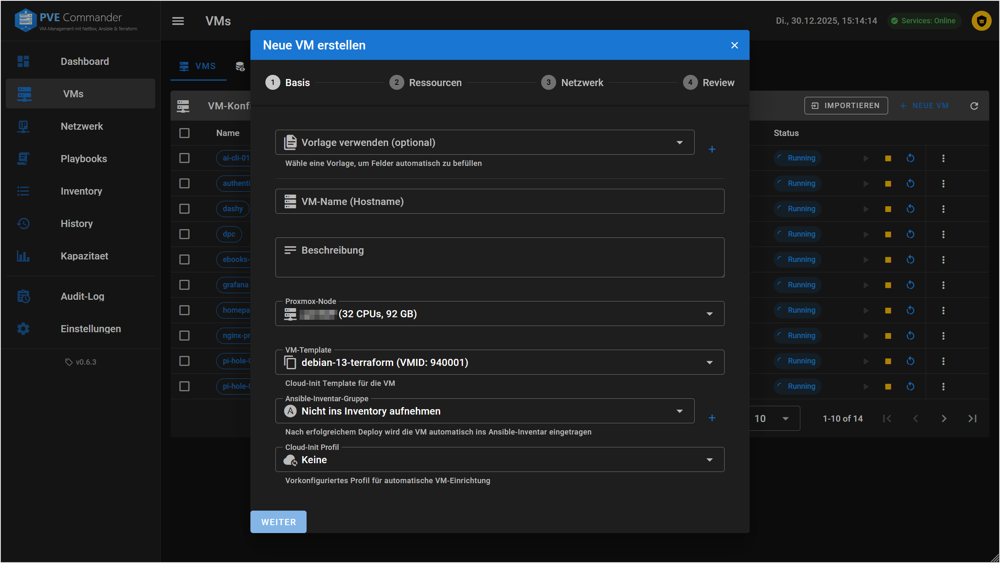
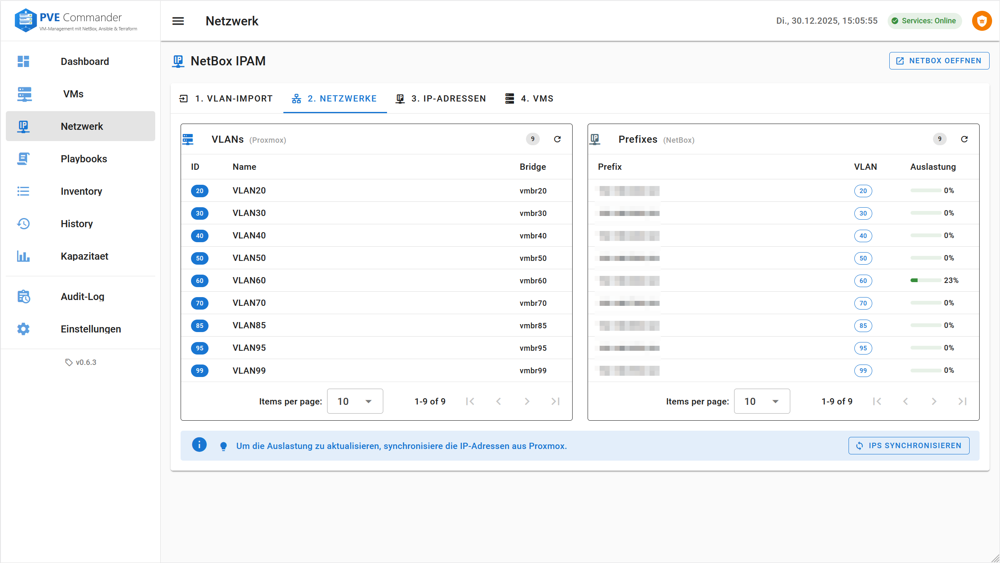
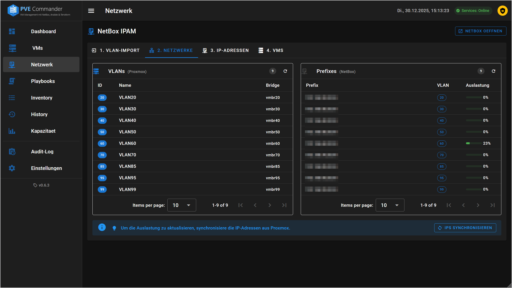

<p align="center">
  
</p>

<p align="center">
  <a href="#deutsch">Deutsch</a> | <a href="#english">English</a>
</p>

<p align="center">
  <a href="https://github.com/dvaper/pve-commander/releases"></a>
  <a href="https://github.com/dvaper/pve-commander/actions"></a>
  <a href="https://github.com/dvaper/pve-commander/blob/main/LICENSE"></a>
</p>

<p align="center">
  
  
  
  
</p>

---

<h1 id="deutsch">Deutsch</h1>

**VM-Management-Plattform fuer Proxmox VE** mit integriertem NetBox (IPAM/DCIM), Ansible und Terraform.

## Screenshots

<table>
<tr>
<td width="50%">
<p align="center"><strong>Light Mode</strong></p>

</td>
<td width="50%">
<p align="center"><strong>Dark Mode</strong></p>

</td>
</tr>
</table>

<details>
<summary><strong>Weitere Screenshots</strong></summary>

### VM-Inventar
<table>
<tr>
<td width="50%"></td>
<td width="50%"></td>
</tr>
</table>

### VM-Deployment
<table>
<tr>
<td width="50%"></td>
<td width="50%"></td>
</tr>
</table>

### Ansible
<table>
<tr>
<td width="50%"></td>
<td width="50%"></td>
</tr>
</table>

### NetBox Integration
<table>
<tr>
<td width="50%"></td>
<td width="50%"></td>
</tr>
</table>

</details>

---

## Features

| Bereich | Funktionen |
|---------|------------|
| **VM-Management** | Deployment via Terraform, Power Control, Snapshots, Cloning, Migration, Backup, dynamische Node-Erkennung |
| **RBAC** | Rollen mit granularen Berechtigungen, Host-Zuweisungen, Gruppen |
| **Audit** | Hash-Chain Verifikation, Export (JSON/CSV), Snapshot-Logging |
| **Ansible** | Playbook-Ausfuehrung mit Live-Output (WebSocket), Inventory/Playbook Editor |
| **NetBox IPAM** | Automatische IP-Vergabe, Netzwerk-Uebersicht (integrierter Container) |
| **Cloud-Init** | 13 Profile (Docker, K8s, Web, DB, etc.), SSH-Hardening |
| **Sicherheit** | Rate-Limiting, Non-root Container, Security Headers, Security Status Panel |
| **UI** | 5 Themes, Light/Dark Mode, Command Palette (Cmd+K), Rail-Mode Sidebar |

## Quick Start

```bash
mkdir pve-commander && cd pve-commander
curl -LO https://raw.githubusercontent.com/dvaper/pve-commander/main/docker-compose.yml
mkdir -p data/{db,inventory,playbooks,roles,terraform,ssh,config}
sudo chown -R 1000:1000 data/
docker compose up -d
# Browser: http://localhost:8080/setup
```

## Docker Images

```bash
docker pull ghcr.io/dvaper/pve-commander/dpc-web:latest
docker pull ghcr.io/dvaper/pve-commander/dpc-api:latest
```

## Voraussetzungen

| Komponente | Minimum | Empfohlen |
|------------|---------|-----------|
| Docker | 24.x | 27.x+ |
| Docker Compose | v2.20 | v2.30+ |
| RAM | 4 GB | 8 GB |
| Disk | 10 GB | 20 GB |

**Proxmox VE:** Version 8.x oder 9.x mit API-Token

<details>
<summary><strong>Proxmox API-Token erstellen</strong></summary>

```bash
pveum role add TerraformRole -privs "VM.Allocate VM.Clone VM.Config.Disk VM.Config.CPU VM.Config.Memory VM.Config.Network VM.Config.Cloudinit VM.Config.Options VM.PowerMgmt VM.Audit VM.Snapshot VM.Snapshot.Rollback VM.Migrate Datastore.AllocateSpace Datastore.Audit Sys.Audit"
pveum user add terraform@pve
pveum aclmod / -user terraform@pve -role TerraformRole
pveum user token add terraform@pve terraform-token --privsep=0
```

</details>

## Installation (VM)

### 1. Docker installieren

```bash
sudo apt update && sudo apt upgrade -y
sudo apt install -y ca-certificates curl gnupg
sudo install -m 0755 -d /etc/apt/keyrings
curl -fsSL https://download.docker.com/linux/debian/gpg | sudo gpg --dearmor -o /etc/apt/keyrings/docker.gpg
echo "deb [arch=$(dpkg --print-architecture) signed-by=/etc/apt/keyrings/docker.gpg] https://download.docker.com/linux/debian $(. /etc/os-release && echo $VERSION_CODENAME) stable" | sudo tee /etc/apt/sources.list.d/docker.list > /dev/null
sudo apt update && sudo apt install -y docker-ce docker-ce-cli containerd.io docker-buildx-plugin docker-compose-plugin
sudo usermod -aG docker $USER
```

### 2. Anwendung starten

```bash
# Verzeichnis erstellen
sudo mkdir -p /opt/pve-commander && sudo chown $USER:$USER /opt/pve-commander
cd /opt/pve-commander

# docker-compose.yml herunterladen
curl -LO https://raw.githubusercontent.com/dvaper/pve-commander/main/docker-compose.yml

# Data-Verzeichnisse mit korrekten Berechtigungen erstellen (Non-root Container)
mkdir -p data/{db,inventory,playbooks,roles,terraform,ssh,config}
sudo chown -R 1000:1000 data/

# Starten (Core-Services: Web + API + Postgres + Redis)
docker compose up -d
```

### 3. Setup-Wizard

```
http://<vm-ip>:8080/setup
```

**NetBox-Optionen im Setup-Wizard:**
- **Integriertes NetBox**: Wird automatisch gestartet (Erstinstallation dauert ca. 5-10 Min)
- **Externes NetBox**: Verbindung zu bestehender NetBox-Instanz
- **Kein NetBox**: IP-Adressen manuell verwalten

### 4. NetBox manuell starten (optional)

Falls NetBox spaeter manuell gestartet werden soll:

```bash
# NetBox-Profile aktivieren
docker compose --profile netbox up -d

# Status pruefen (dauert bei Erstinstallation 5-10 Minuten)
docker compose logs -f netbox
```

## Ports

| Service | Port |
|---------|------|
| PVE Commander | 8080 |
| NetBox | 8081 |

## Update

```bash
docker compose pull && docker compose up -d
```

## Architektur

```
┌─────────────────────────────────────────────────────────┐
│                    Docker Compose                        │
│  ┌─────────┐  ┌─────────┐  ┌─────────────────────────┐  │
│  │ dpc-web │  │ dpc-api │  │       NetBox Stack      │  │
│  │ (Vue.js)│  │(FastAPI)│  │ NetBox + Postgres + Redis│  │
│  │  :8080  │  │  :8000  │  │         :8081           │  │
│  └────┬────┘  └────┬────┘  └───────────┬─────────────┘  │
│       │            │                   │                │
│       └────────────┼───────────────────┘                │
│                    │                                    │
└────────────────────┼────────────────────────────────────┘
                     │
        ┌────────────┼────────────┐
        ▼            ▼            ▼
   ┌─────────┐  ┌─────────┐  ┌─────────┐
   │Proxmox  │  │  VMs    │  │ NetBox  │
   │   API   │  │  (SSH)  │  │  IPAM   │
   └─────────┘  └─────────┘  └─────────┘
```

## Backup

**Integriert:** Verwaltung > Backup & Restore

**Manuell:**
```bash
cd /opt/pve-commander
tar -czvf backup-$(date +%Y%m%d).tar.gz data/
```

## Troubleshooting

| Problem | Loesung |
|---------|---------|
| Container startet nicht | `docker compose logs dpc-api` |
| Login funktioniert nicht | `.env` pruefen, Container neu starten |
| NetBox nicht erreichbar | `docker compose --profile netbox up -d` (NetBox muss separat gestartet werden) |
| NetBox Fehler | `docker compose --profile netbox restart` |
| Proxmox-Verbindung fehlgeschlagen | API-Token Berechtigungen, Firewall (Port 8006), SSL-Einstellung pruefen |

## Sicherheit

<details>
<summary><strong>Security Hardening</strong></summary>

### Implementierte Sicherheitsmassnahmen

| Massnahme | Beschreibung |
|-----------|--------------|
| **Rate-Limiting** | Login (5/min), Password-Reset (3/min), Setup-Wizard |
| **Non-root Container** | API laeuft als `appuser` (UID 1000) |
| **Security Headers** | CSP, X-Frame-Options, X-XSS-Protection, etc. |
| **Timing-Attack Schutz** | Konstante Vergleichszeit bei Login |
| **Docker Healthchecks** | Automatische Container-Ueberwachung |

### Produktion

Fuer Produktionsumgebungen:

```bash
# .env erstellen mit sicherem SECRET_KEY
echo "SECRET_KEY=$(openssl rand -hex 32)" >> data/config/.env

# CORS konfigurieren (ersetze mit deiner Domain)
echo 'CORS_ORIGINS=["https://your-domain.com"]' >> data/config/.env

# Container neu starten
docker compose restart dpc-api
```

### Security Status

Der Sicherheitsstatus kann unter **Einstellungen > Sicherheit** eingesehen werden (nur Super-Admin).

</details>

## Lizenz

MIT

---

<h1 id="english">English</h1>

**VM Management Platform for Proxmox VE** with integrated NetBox (IPAM/DCIM), Ansible, and Terraform.

## Screenshots

<table>
<tr>
<td width="50%">
<p align="center"><strong>Light Mode</strong></p>

</td>
<td width="50%">
<p align="center"><strong>Dark Mode</strong></p>

</td>
</tr>
</table>

<details>
<summary><strong>More Screenshots</strong></summary>

### VM Inventory
<table>
<tr>
<td width="50%"></td>
<td width="50%"></td>
</tr>
</table>

### VM Deployment
<table>
<tr>
<td width="50%"></td>
<td width="50%"></td>
</tr>
</table>

### Ansible
<table>
<tr>
<td width="50%"></td>
<td width="50%"></td>
</tr>
</table>

### NetBox Integration
<table>
<tr>
<td width="50%"></td>
<td width="50%"></td>
</tr>
</table>

</details>

---

## Features

| Area | Functions |
|------|-----------|
| **VM Management** | Deployment via Terraform, Power Control, Snapshots, Cloning, Migration, Backup, dynamic node discovery |
| **RBAC** | Roles with granular permissions, host assignments, groups |
| **Audit** | Hash-chain verification, export (JSON/CSV), snapshot logging |
| **Ansible** | Playbook execution with live output (WebSocket), inventory/playbook editor |
| **NetBox IPAM** | Automatic IP allocation, network overview (integrated container) |
| **Cloud-Init** | 13 profiles (Docker, K8s, Web, DB, etc.), SSH hardening |
| **Security** | Rate-limiting, non-root container, security headers, security status panel |
| **UI** | 5 themes, light/dark mode, command palette (Cmd+K), rail-mode sidebar |

## Quick Start

```bash
mkdir pve-commander && cd pve-commander
curl -LO https://raw.githubusercontent.com/dvaper/pve-commander/main/docker-compose.yml
mkdir -p data/{db,inventory,playbooks,roles,terraform,ssh,config}
sudo chown -R 1000:1000 data/
docker compose up -d
# Browser: http://localhost:8080/setup
```

## Docker Images

```bash
docker pull ghcr.io/dvaper/pve-commander/dpc-web:latest
docker pull ghcr.io/dvaper/pve-commander/dpc-api:latest
```

## Requirements

| Component | Minimum | Recommended |
|-----------|---------|-------------|
| Docker | 24.x | 27.x+ |
| Docker Compose | v2.20 | v2.30+ |
| RAM | 4 GB | 8 GB |
| Disk | 10 GB | 20 GB |

**Proxmox VE:** Version 8.x or 9.x with API token

<details>
<summary><strong>Create Proxmox API Token</strong></summary>

```bash
pveum role add TerraformRole -privs "VM.Allocate VM.Clone VM.Config.Disk VM.Config.CPU VM.Config.Memory VM.Config.Network VM.Config.Cloudinit VM.Config.Options VM.PowerMgmt VM.Audit VM.Snapshot VM.Snapshot.Rollback VM.Migrate Datastore.AllocateSpace Datastore.Audit Sys.Audit"
pveum user add terraform@pve
pveum aclmod / -user terraform@pve -role TerraformRole
pveum user token add terraform@pve terraform-token --privsep=0
```

</details>

## Installation (VM)

### 1. Install Docker

```bash
sudo apt update && sudo apt upgrade -y
sudo apt install -y ca-certificates curl gnupg
sudo install -m 0755 -d /etc/apt/keyrings
curl -fsSL https://download.docker.com/linux/debian/gpg | sudo gpg --dearmor -o /etc/apt/keyrings/docker.gpg
echo "deb [arch=$(dpkg --print-architecture) signed-by=/etc/apt/keyrings/docker.gpg] https://download.docker.com/linux/debian $(. /etc/os-release && echo $VERSION_CODENAME) stable" | sudo tee /etc/apt/sources.list.d/docker.list > /dev/null
sudo apt update && sudo apt install -y docker-ce docker-ce-cli containerd.io docker-buildx-plugin docker-compose-plugin
sudo usermod -aG docker $USER
```

### 2. Start Application

```bash
# Create directory
sudo mkdir -p /opt/pve-commander && sudo chown $USER:$USER /opt/pve-commander
cd /opt/pve-commander

# Download docker-compose.yml
curl -LO https://raw.githubusercontent.com/dvaper/pve-commander/main/docker-compose.yml

# Create data directories with correct permissions (non-root container)
mkdir -p data/{db,inventory,playbooks,roles,terraform,ssh,config}
sudo chown -R 1000:1000 data/

# Start (core services: Web + API + Postgres + Redis)
docker compose up -d
```

### 3. Setup Wizard

```
http://<vm-ip>:8080/setup
```

**NetBox options in the Setup Wizard:**
- **Integrated NetBox**: Started automatically (first installation takes ~5-10 min)
- **External NetBox**: Connect to existing NetBox instance
- **No NetBox**: Manage IP addresses manually

### 4. Start NetBox manually (optional)

If you want to start NetBox later manually:

```bash
# Activate NetBox profile
docker compose --profile netbox up -d

# Check status (first installation takes 5-10 minutes)
docker compose logs -f netbox
```

## Ports

| Service | Port |
|---------|------|
| PVE Commander | 8080 |
| NetBox | 8081 |

## Update

```bash
docker compose pull && docker compose up -d
```

## Architecture

```
┌─────────────────────────────────────────────────────────┐
│                    Docker Compose                        │
│  ┌─────────┐  ┌─────────┐  ┌─────────────────────────┐  │
│  │ dpc-web │  │ dpc-api │  │       NetBox Stack      │  │
│  │ (Vue.js)│  │(FastAPI)│  │ NetBox + Postgres + Redis│  │
│  │  :8080  │  │  :8000  │  │         :8081           │  │
│  └────┬────┘  └────┬────┘  └───────────┬─────────────┘  │
│       │            │                   │                │
│       └────────────┼───────────────────┘                │
│                    │                                    │
└────────────────────┼────────────────────────────────────┘
                     │
        ┌────────────┼────────────┐
        ▼            ▼            ▼
   ┌─────────┐  ┌─────────┐  ┌─────────┐
   │Proxmox  │  │  VMs    │  │ NetBox  │
   │   API   │  │  (SSH)  │  │  IPAM   │
   └─────────┘  └─────────┘  └─────────┘
```

## Backup

**Integrated:** Settings > Backup & Restore

**Manual:**
```bash
cd /opt/pve-commander
tar -czvf backup-$(date +%Y%m%d).tar.gz data/
```

## Troubleshooting

| Problem | Solution |
|---------|----------|
| Container won't start | `docker compose logs dpc-api` |
| Login not working | Check `.env`, restart container |
| NetBox not reachable | `docker compose --profile netbox up -d` (NetBox must be started separately) |
| NetBox errors | `docker compose --profile netbox restart` |
| Proxmox connection failed | Check API token permissions, firewall (port 8006), SSL settings |

## Security

<details>
<summary><strong>Security Hardening</strong></summary>

### Implemented Security Measures

| Measure | Description |
|---------|-------------|
| **Rate-Limiting** | Login (5/min), password reset (3/min), setup wizard |
| **Non-root Container** | API runs as `appuser` (UID 1000) |
| **Security Headers** | CSP, X-Frame-Options, X-XSS-Protection, etc. |
| **Timing-Attack Protection** | Constant comparison time for login |
| **Docker Healthchecks** | Automatic container monitoring |

### Production

For production environments:

```bash
# Create .env with secure SECRET_KEY
echo "SECRET_KEY=$(openssl rand -hex 32)" >> data/config/.env

# Configure CORS (replace with your domain)
echo 'CORS_ORIGINS=["https://your-domain.com"]' >> data/config/.env

# Restart container
docker compose restart dpc-api
```

### Security Status

Security status can be viewed at **Settings > Security** (super admin only).

</details>

## License

MIT
